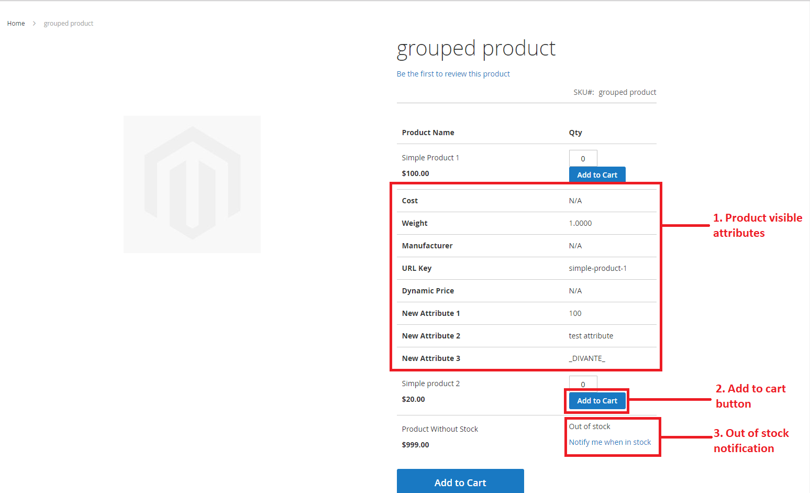

# Magento 2 Grouped Products Manager
 
Module Grouped Products Manager adds 3 basics features for grouped products:

   1) It allows to show specific attributes for each simple product within grouped
   
   2) Adds "Add To Cart" button for each simple product. There is 2 options which product we need to add:

   2.1) Simple product - product which is not part of grouped product

   2.2) Linked product - which is part of grouped product

   3) Adds "Notify me when in stock" link to subscribe notification when specific simple product come back to stock

## Who is developing Grouped Products Manager ?

    

Divante has been delivering the highest quality e-commerce solutions since its inception in 2008. Our main focus is to create the most elegant and effective e-commerce services. We connect the latest technology with a great business approach.
Visit our website for more information  <a href="https://divante.co/">Divante.co</a> 

## Compatibility
* Module was tested on Magento 2.1.7.

## CLI usage:
* There is no CLI commands.
 
## Extensibility
* Views or features texts/additionals could be extended in view/frontend/templates/product/view/type/grouped.phtml file.
* Grouped class extends Magento's original block and there are additional functions for proper working. If you want. 

## Module API (public methods)
* Module does not have API
 
## Additional information
* Module installs 1 new attribute for grouped product "products_attributes_visibility", which contains serialized 
attributes ids for each simple product within grouped.
* Module contains 2 helper classes (Config and OutOfStock). Config deals with configuration part, and OutOfStock could return 
url for out of stock notification for given product (both could be extended).

## Setup

#### Installation details
 
* `php bin/magento setup:upgrade`
* `php bin/magento module:enable Divante_GroupedProductsManager`

#### Admin configuration

go to admin panel:

        stores => 
                configuration => 
                          divante extensiuons => 
                                   grouped products manager (and then enable needed features)
 
   
 
    
 
    
#### Product attributes checker on grouped product page (admin panel)

go to admin panel :

        products => 
                catalog => 
                          choose grouped product => 
                                   grouped products tab
                                   
                                   
 
    
    
#### Features on front

 
    
## License
* The Grouped Products Manager module is licensed under the terms of the MIT license.
    
## Standards & Code Quality
* This module respects all Magento2 code quality rules and our own PHPCS and PHPMD rulesets.