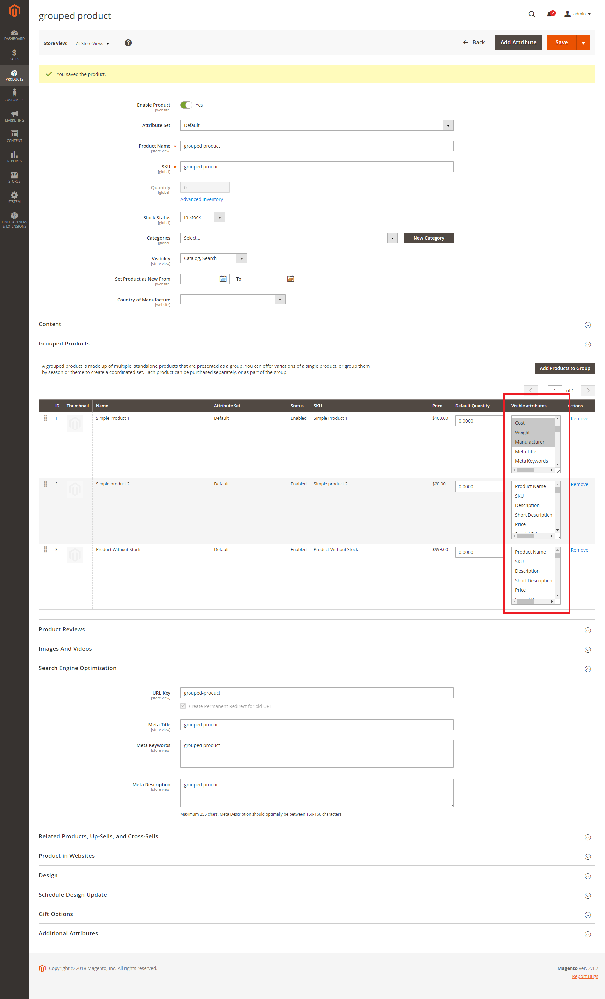

# Magento 2 Grouped Products Manager
Module Grouped Products Manager adds 3 basics features for grouped products:

   1) It allows to show specific attributes for each simple product within grouped
   
   2) Adds "Add To Cart" button for each simple product. There is 2 options which product we need to add:

   2.1) Simple product - product which is not part of grouped product

   2.2) Linked product - which is part of grouped product

   3) Adds "Notify me when in stock" link to subscribe notification when specific simple product come back to stock

## Compatibility
Module was tested on Magento 2.1.7.

## Installing/Getting started
1) `php bin/magento setup:upgrade`
2) `php bin/magento module:enable Divante_GroupedProductsManager`
3) configure module in admin panel

## Features

## Configuration

#### Admin configuration
go to admin panel:

        stores => 
                configuration => 
                          divante extensiuons => 
                                   grouped products manager (and then enable needed features)
 
   
 
 
#### Product attributes checker on grouped product page (admin panel)
go to admin panel :

        products => 
                catalog => 
                          choose grouped product => 
                                   grouped products tab
                                   
NOTE:
Attributes must be `Visible on Catalog Pages on Storefront`

 
    
## Contributing

If you'd like to contribute, please fork the repository and use a feature branch. Pull requests are warmly welcome.

## Licensing

The code in this project is licensed under the MIT license.

## Standards & Code Quality

This module respects all Magento2 code quality rules and our own PHPCS and PHPMD rulesets.

## About Authors

We are a Software House from Europe, existing from 2008 and employing about 150 people. Our core competencies are built around Magento, Pimcore and bespoke software projects (we love Symfony3, Node.js, Angular, React, Vue.js). We specialize in sophisticated integration projects trying to connect hardcore IT with good product design and UX.

We work for Clients like INTERSPORT, ING, Odlo, Onderdelenwinkel and CDP, the company that produced The Witcher game. We develop two projects: [Open Loyalty](http://www.openloyalty.io/ "Open Loyalty") - an open source loyalty program and [Vue.js Storefront](https://github.com/DivanteLtd/vue-storefront "Vue.js Storefront").

We are part of the OEX Group which is listed on the Warsaw Stock Exchange. Our annual revenue has been growing at a minimum of about 30% year on year.

Visit our website [Divante.co](https://divante.co/ "Divante.co") for more information.